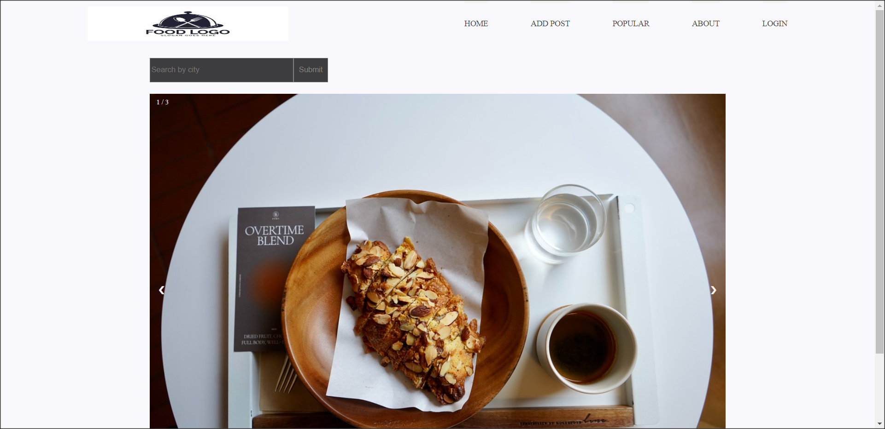

## Foodie Tracker

This application mimics a social media platform by allowing its users to come together over and discuss local eateries; you can create posts about little-known restaurants and share any hidden gems in the local area. The application allows the users to include a picture with their post to provide more details about the food or the restaurant as a whole.

 

 
 

The application includes the uses the following dependencies:
connect-session-sequelize, dotenv, express, express-handlebars, express-session, mysql2, and sequelize.
It also makes use of the Cloudinary api to accept images. In the future, SerpAPI may be used for location details.